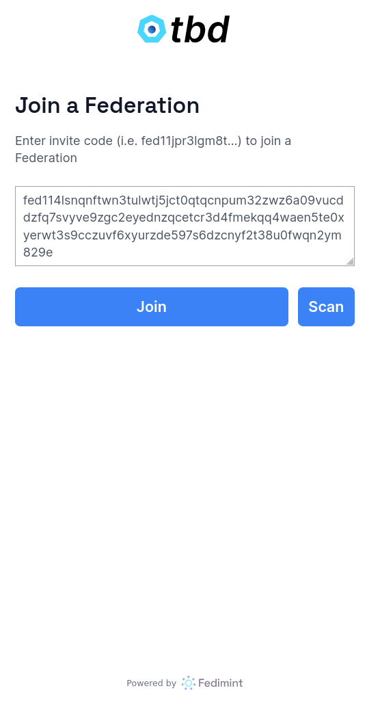
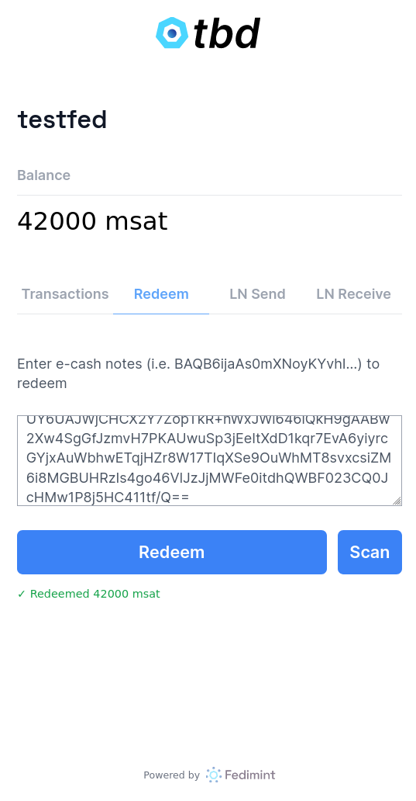
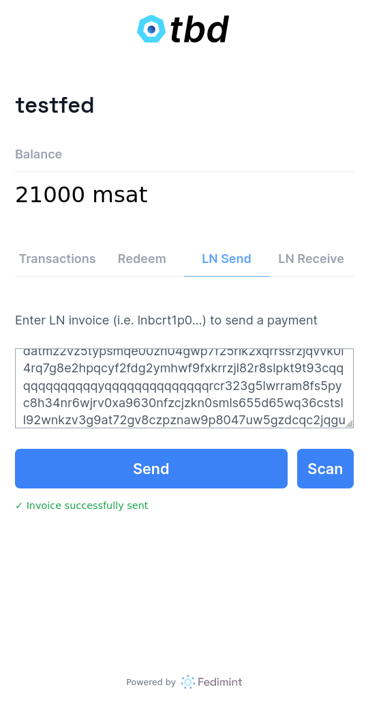
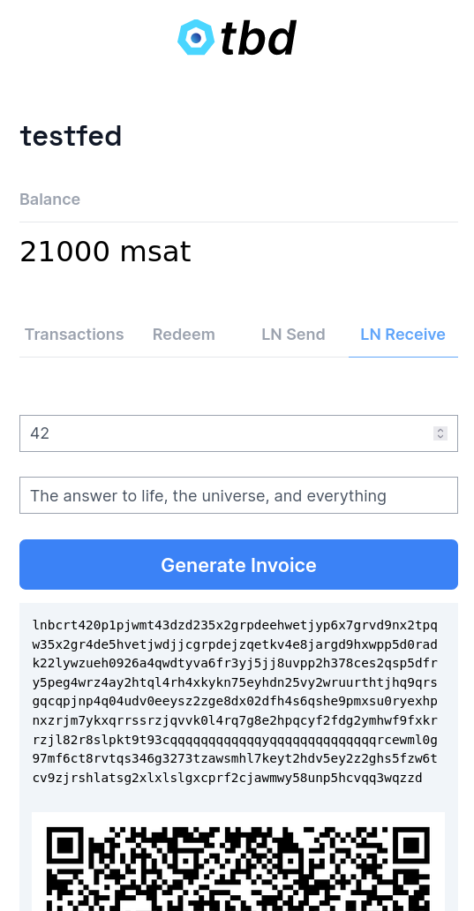
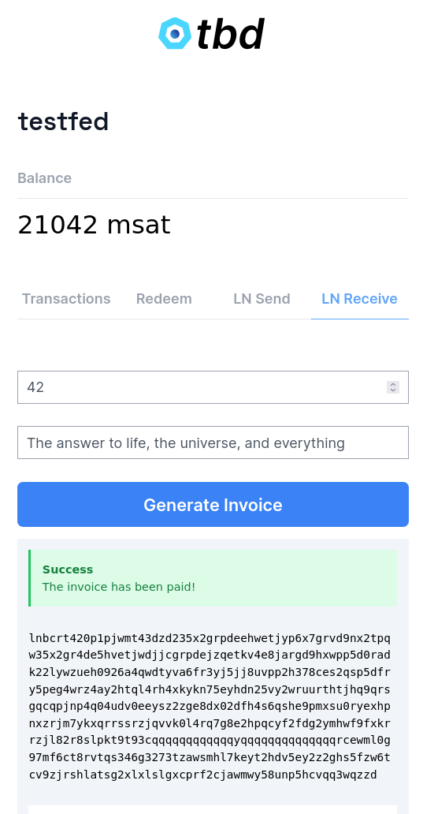
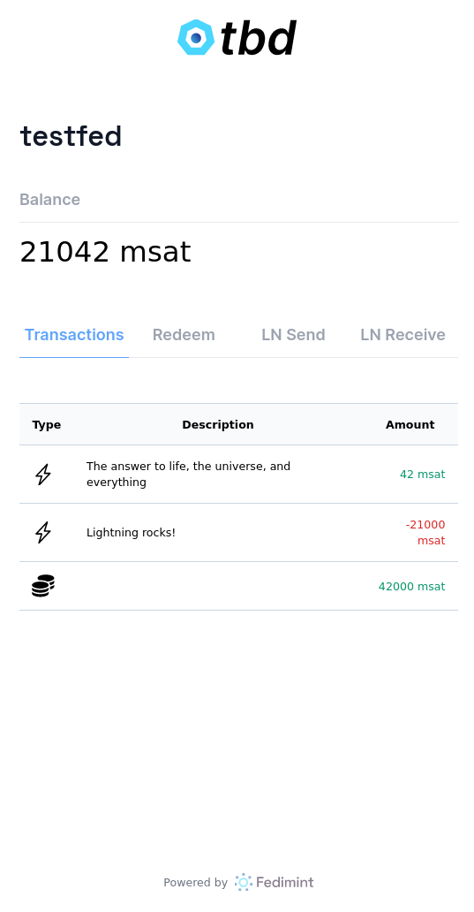
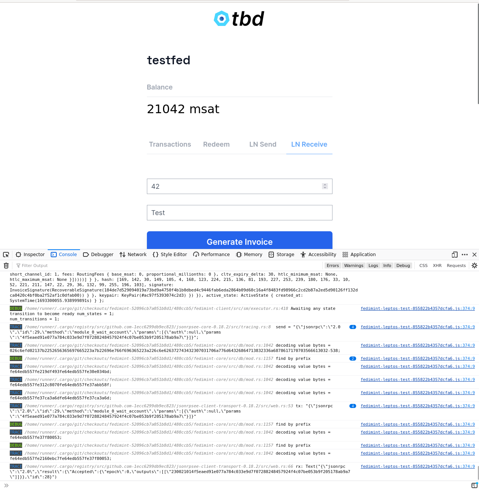

**CAUTION: highly experimental, the Database implementation is likely horribly broken**

# Fedimint Client built with [Leptos](https://github.com/leptos-rs/leptos)

This repo contains a proof-of-concept of how to integrate `fedimint-client` with the Leptos web framework to build a
PWA. There are still some bugs being worked out, but there is a demo available at https://webimint.sirion.io/.

||||
----|----|----
||||

## Prerequisites

Check out [Fedimint](https://github.com/fedimint/fedimint) branch `releases/v0.2`:

```shell
git clone https://github.com/fedimint/fedimint
cd fedimint
git checkout releases/v0.2
```

Make sure you have [set up local dev environment](https://github.com/fedimint/fedimint/blob/master/docs/dev-env.md) needed to run `fedimint` locally

Open terminal and run to open development shell:

```shell
nix develop

just build
just mprocs
```

To get an invite code (you'll need it for next steps) select `user` process and enter `fedimint-cli dev invite-code`.

Example
```bash
bash-5.1$ fedimint-cli dev invite-code
{
  "invite_code": "fed1132h0j84q5t6qzg8vkxk2lj3dmmzw54flqh3m6z4yrf6ryyerrn6sg36nuratsuf0mjvm84svt40cuqq4waen5te0xyerwt3s9cczuvf6xyurzde59ld2c273s3xm3z3ms552g7x2yu0"
}
```

The invite code is needed in next step `Development`.


## Development

1. Open terminal and enter:

```shell 
nix develop

# only once
npm i

trunk serve
```

Your output will look like this:

```shell
$ nix develop
💡 Run 'just' for a list of available 'just ...' helper recipes
$ trunk serve
2023-08-06T12:00:41.373844Z  INFO 📦 starting build
2023-08-06T12:00:41.374062Z  INFO spawning asset pipelines
2023-08-06T12:00:41.522959Z  INFO building webimint
    Finished dev [unoptimized + debuginfo] target(s) in 0.14s
2023-08-06T12:00:41.673972Z  INFO fetching cargo artifacts
2023-08-06T12:00:41.834730Z  INFO processing WASM for webimint
2023-08-06T12:00:41.933395Z  INFO calling wasm-bindgen for webimint
2023-08-06T12:00:42.907392Z  INFO copying generated wasm-bindgen artifacts
2023-08-06T12:00:42.919447Z  INFO applying new distribution
2023-08-06T12:00:42.919736Z  INFO ✅ success
2023-08-06T12:00:42.919871Z  INFO 📡 serving static assets at -> /
2023-08-06T12:00:42.919899Z  INFO 📡 server listening at http://127.0.0.1:8080
```

2. Open [http://127.0.0.1:8080](http://127.0.0.1:8080) in your browser

3. Enter invite code into to input and submit. Check `Prerequisites` above to see how to get it.

To see what's going on underneath open the browser console:


