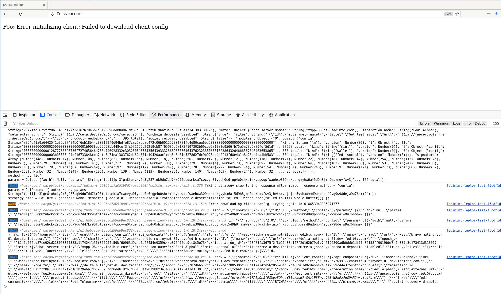

**CAUTION: highly experimental, the Database implementation is likely horribly broken**

# Fedimint Client built with [Leptos](https://github.com/leptos-rs/leptos)

This repo contains a proof-of-concept of how to integrate `fedimint-client` with the Leptos web framework to build a
PWA. There are still some bugs being worked out, but there is a demo available at https://fedimint-leptos.sirion.io/.

## (Temporary) Pre-requirements (will be changed for sure)

- Custom fork of `fedimint` is needed: https://github.com/okjodom/fedimint/tree/cfg-in-db Check it out.
- Make sure you have [set up local dev environment](https://github.com/fedimint/fedimint/blob/master/docs/dev-env.md) needed to run `fedimint` locally
- Run `nix develop`, then `just build` and `just mprocs` to open a development shell. 
- To get an invite code (you'll need it for next steps) select `user` process and enter `fedimint-cli dev invite-code`.

Example
```bash
bash-5.1$ fedimint-cli dev invite-code
{
  "invite_code": "fed1132h0j84q5t6qzg8vkxk2lj3dmmzw54flqh3m6z4yrf6ryyerrn6sg36nuratsuf0mjvm84svt40cuqq4waen5te0xyerwt3s9cczuvf6xyurzde59ld2c273s3xm3z3ms552g7x2yu0"
}
```
- Use this invite code as described in next step `run`


## Run

To run it enter the `nix develop` shell, run `trunk serve` and open `http://127.0.0.1:8080` in your browser. 

```
fedimint-leptos-test$ nix develop
💡 Run 'just' for a list of available 'just ...' helper recipes
fedimint-leptos-test$ trunk serve
2023-08-06T12:00:41.373844Z  INFO 📦 starting build
2023-08-06T12:00:41.374062Z  INFO spawning asset pipelines
2023-08-06T12:00:41.522959Z  INFO building fedimint-leptos-test
    Finished dev [unoptimized + debuginfo] target(s) in 0.14s
2023-08-06T12:00:41.673972Z  INFO fetching cargo artifacts
2023-08-06T12:00:41.834730Z  INFO processing WASM for fedimint-leptos-test
2023-08-06T12:00:41.933395Z  INFO calling wasm-bindgen for fedimint-leptos-test
2023-08-06T12:00:42.907392Z  INFO copying generated wasm-bindgen artifacts
2023-08-06T12:00:42.919447Z  INFO applying new distribution
2023-08-06T12:00:42.919736Z  INFO ✅ success
2023-08-06T12:00:42.919871Z  INFO 📡 serving static assets at -> /
2023-08-06T12:00:42.919899Z  INFO 📡 server listening at http://127.0.0.1:8080
```

Enter invite code into to input and submit. Check `Pre-requirements` above to see how to get it.

You should see "Starting client" in the browser and the JS console should be logging a lot:


